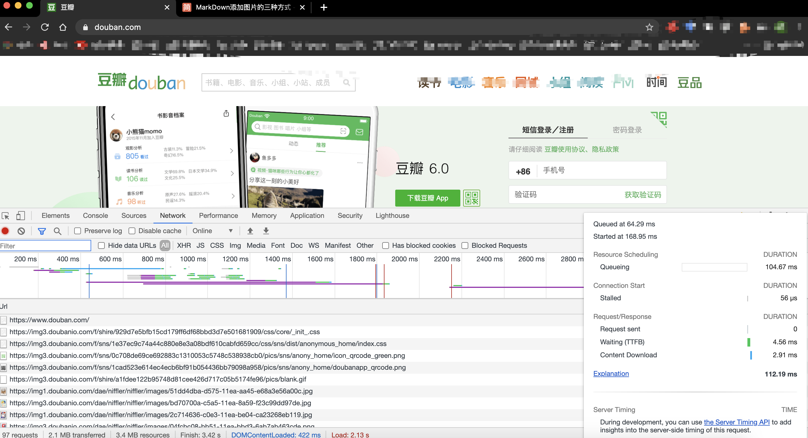
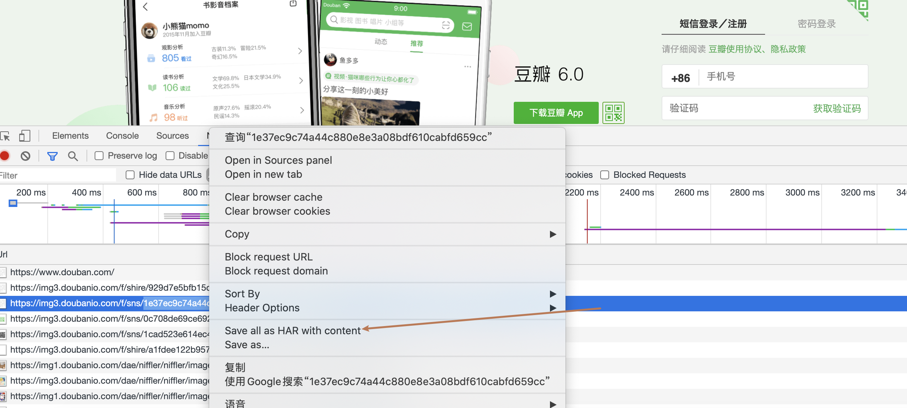

# Chrome-Package-Handler
chrome抓包解析工具

### 描述
- 目前chrome只能到处har格式的文件
- 本项目通过解析har包，变成需要的内容
- 通过请求的url 在result(默认文件夹)下生成对应的文件
- 文件内容就是url,header,response
- 程序运行前删除项目中的urls/result文件夹中的所有文件(演示的demo)

### ENV
- python2.7 +

### PREPARE


- 选择save all as HAR ...进行保存，文件后缀是har格式

### RUN 
- Python handler.py -h 
``` shell
optional arguments:
  -h, --help            show this help message and exit
  -c {url,header,request,response,all} [{url,header,request,response,all} ...], --choice {url,header,request,response,all} [{url,header,request,response,all} ...]
                        抓取的内容选择
  -s SAVE, --save SAVE  结果保存的路径
  -d DIR, --dir DIR     文件读取路径
```
- 可以自定义文件读取路径 默认是项目中urls文件夹
``` shell
python handler.py -c url -d <你保存文件的文件夹名称>
```
- 可以自定义文件保存路径 默认是项目中的results文件夹
``` shell
python handler.py -c url -s <你想保存文件的文件夹名称>
```

### 演示
#

- 收集到的har文件可以放在项目的urls文件夹中，也可以在命令行指定读取那个文件夹，注意是文件夹路径，不是文件路径
- 会自动从指定的文件夹下搜寻har包
- 会在result文件夹在生成解析har包的内容
- 保存的文件是请求的url(不保存协议头，和请求参数)
- 每个文件内容是一个json
- json第一层是请求的url全路径
- json的第二层是自定义收集的内容--> url /request /response
